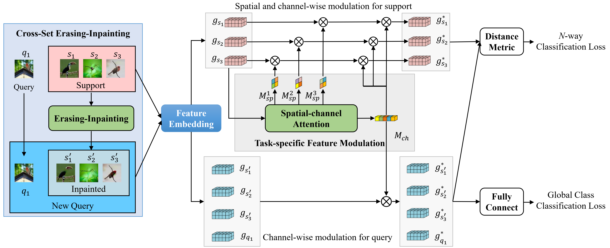

# CSEI

Learning Intact Features by Erasing-Inpainting for Few-shot Classification, [here](https://www.aaai.org/AAAI21Papers/AAAI-540.LiJ.pdf)
## Introduction

In this paper, we propose to learn intact features by erasing-inpainting for fewshot
classification. Specifically, we argue that extracting intact features of target objects is more transferable, and then
propose a novel cross-set erasing-inpainting (CSEI) method. CSEI processes the images in the support set using erasing
and inpainting, and then uses them to augment the query set of the same task. Consequently, the feature embedding produced
by our proposed method can contain more complete information of target objects. In addition, we propose taskspecific feature modulation to make the features adaptive to
the current task.

## Dataset

[Mini-ImageNet](https://drive.google.com/file/d/1KfrNQgOLKLjaD0h1U6dfkmtaobVw2Qkt/view?usp=sharing)
## Our framework



## Acknowledgments

This code is based on the implementations of [**Cross Attention Network for Few-shot Classification**](https://github.com/blue-blue272/fewshot-CAN).

### Training

```
sh train.sh
```
### If you use this code/method or find it helpful, please cite:

```
@article{li2021learning,
  title={Learning Intact Features by Erasing-Inpainting for Few-shot Classification},
  author={Li, Junjie and Wang, Zilei and Hu, Xiaoming},
  year={2021}
}
```
